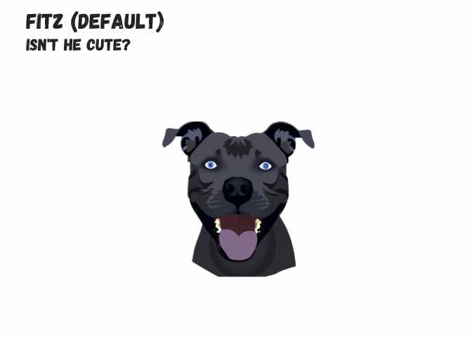
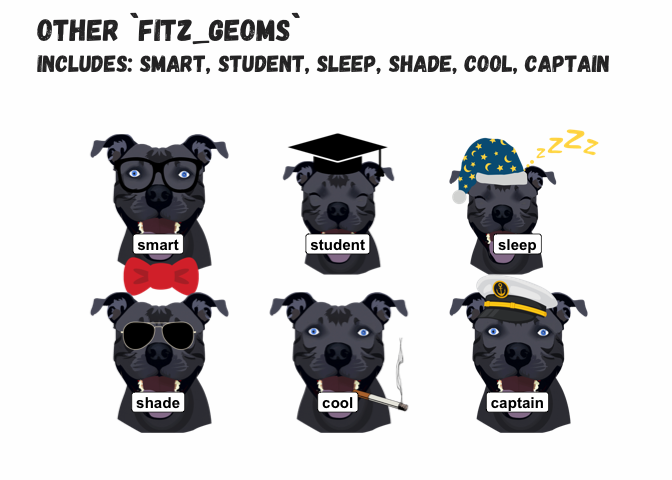
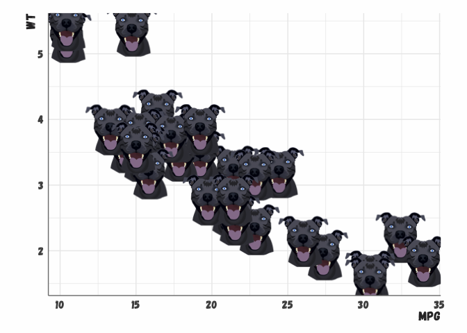
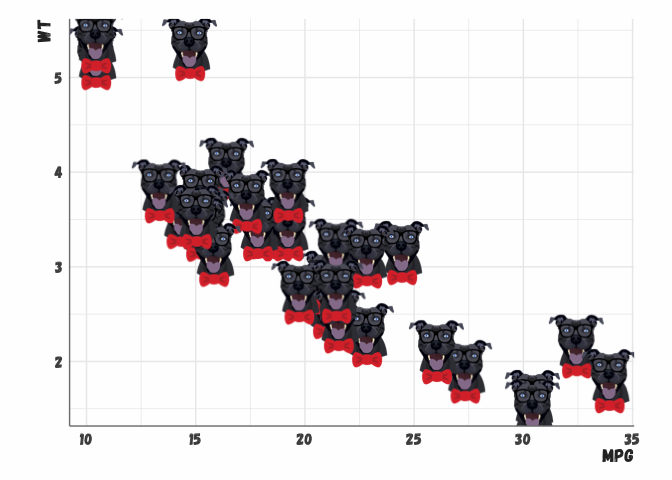
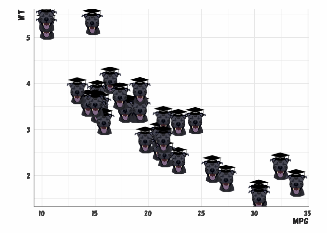
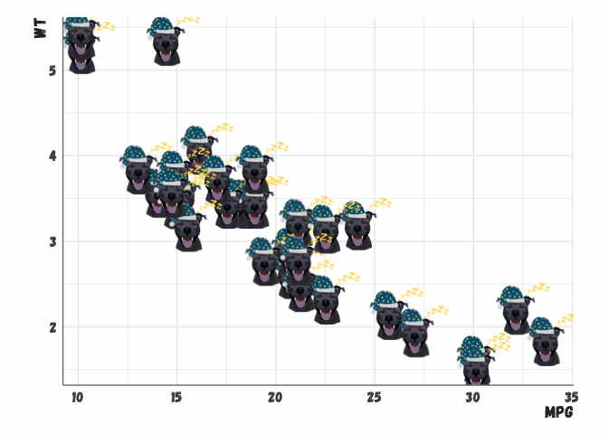
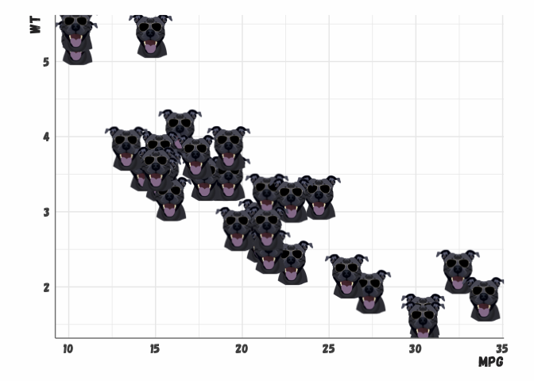
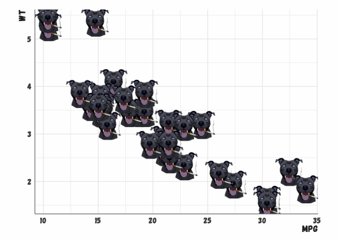
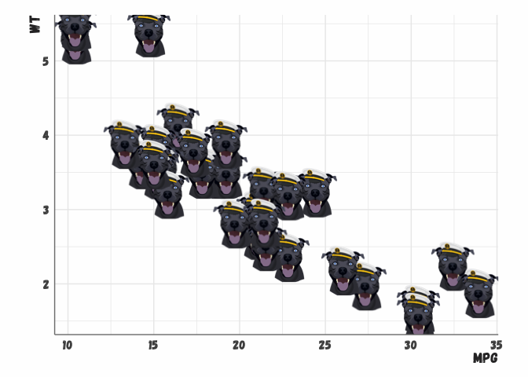

<!-- README.md is generated from README.Rmd. Please edit that file -->

# ggfitz

<!-- badges: start -->

[](https://github.com/emmarshall/ggfitz/actions/workflows/R-CMD-check.yaml)

<!-- badges: end -->

The `ggfitz` package is designed for personal use and teaching the power
of Fitz to students of data science. It provides an easy to use geom for
adding Fitz to ggplot2 objects.

## Installation

``` r
# install.packages("devtools")
devtools::install_github("emmarshall/ggfitz")
```

## Examples





## Fitz `(default)`

``` r
ggplot(mtcars) +
  geom_fitz(aes(mpg, wt), fitz = "fitz") + theme_em()
```



## Fitz `smart`



## Fitz `student`



## Fitz `sleep`



## Fitz `shade`



## Fitz `cool`



## Fitz `captain`



## Acknowledgements

This package is inspired by the
[`ggbernie`](https://github.com/R-CoderDotCom/ggbernie) and
[`ggcats`](https://github.com/R-CoderDotCom/ggcats) packages from the
memeverse. My primary contribution was the Fitz.
